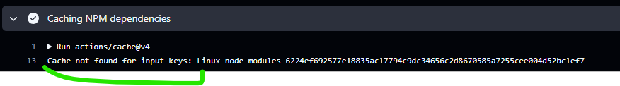
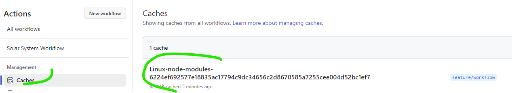
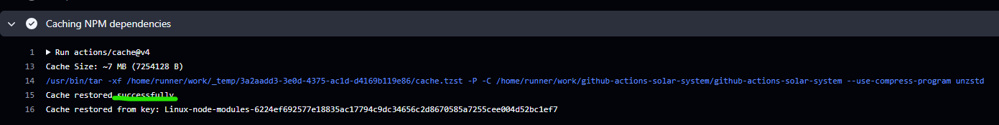
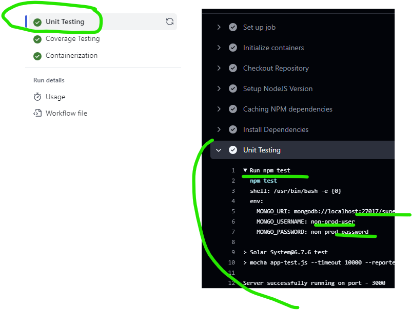
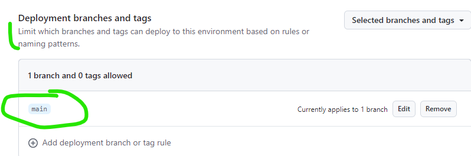
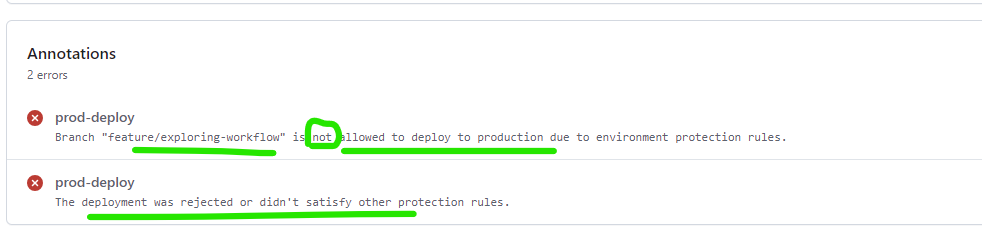
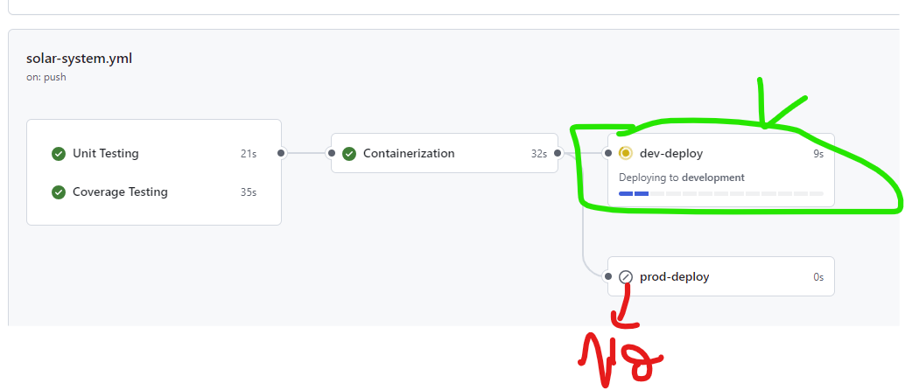

# Solar System NodeJS Application
## Using cache
- First time running cache :


- Cache craeted : 


- Cache found successfully :


### GHCR 
- GITHUB_TOKEN is automatically generated in the secrets (no need to manually put it) => secrets.GITHUB_TOKEN
- When creating a package on ghcr using docker further permissions can be demanded ``` permissions: packages: write ```

### Some best practices (Alice saw that the data base was more adn more sluggish)
- Database more sluggish beceause we are suing the production database with github actions and tests
- We do not use productiondatabase for testing or code coverage puposes.
=> **Solution :** Service Containers (ithub actions container to mock the database)

### About service containers
You can use service containers to connect databases, web services, memory caches, and other tools to your workflow.

```bash
services:
      mongo-db:
        image: siddharth67/mongo-db:non-prod # Whatever image you have already built to run tests ...credentials:
        ports:
          - 27017:27017
    env: # Here is the credentials to access the service container
      MONGO_URI: 'mongodb://localhost:27017/superData'
      MONGO_USERNAME: non-prod-user
      MONGO_PASSWORD: non-prod-password
    steps:
      - name: Unit Testing
        run: npm test
```

- Now the npm test is using the service container as a database


```bash
  # Two containers (from container and from service) [Container to container communication -> No need for port mapping]
    container: 
      image: node:18
    services:
      mongo-db:
        image: siddharth67/mongo-db:non-prod # Whatever image you have already built to run tests ...credentials:
        options: 
          --name mongo
    env: # Here is the credentials to access the service container (As we can see we used the name instead of the port number)
      MONGO_URI: 'mongodb://mongo:27017/superData'
      MONGO_USERNAME: non-prod-user
      MONGO_PASSWORD: non-prod-password
```

### By updating the workflow using job and service containers, the load on the production database has been reduced

# Kubernetes
- By default kubectl needs a kubeconfig file in order to run. 
- A **Kubeconfig** is a YAML file with all the Kubernetes cluster details, certificates, and secret tokens to authenticate the cluster. You might get this config file directly from the **cluster administrator** or from a **cloud platform** if you are using a managed Kubernetes cluster.
- If you want to try on local envirement use the act : [Run your GitHub Actions locally!](https://github.com/nektos/act)!

# Many ways to restrict the workflow from running or enhance secruty :
- We can use the envirenemnt onglet on github UI ti impose some rules like : 



- Or we can use conditional expressions in order to run a certain job
``` bash 
if: contains(github.ref, 'feature/')

if: github.ref == 'refs/heads/main'
```
